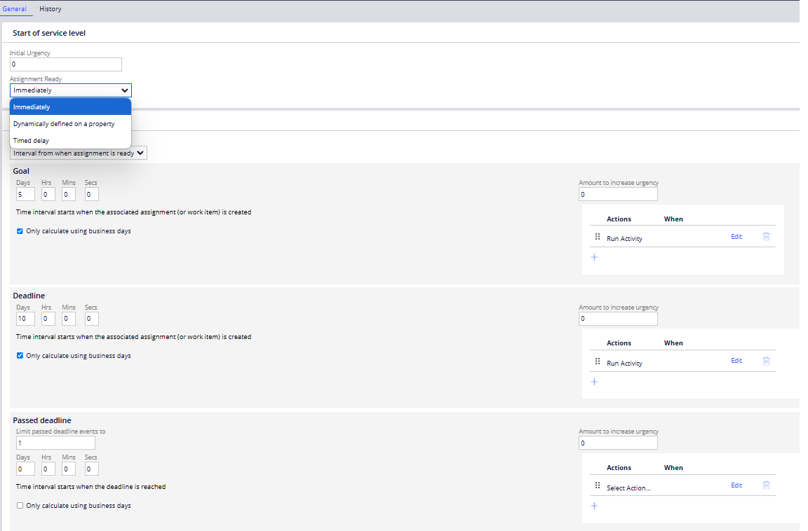

# Detailed SLA Notes for Pega Implementation

---

## Purpose of SLA in Pega
- In Pega, SLAs (Service Level Agreements) are configured to manage the timely resolution of cases and ensure tasks are completed within defined timeframes.
- They help automate and enforce processes to ensure consistent performance and service levels.

---

---

## Key SLA Concepts in Pega

### Goal and Deadline Definition
- **Goal**: The optimal time to complete an assignment or task. This represents the SLA’s first target, and completing the task before the goal ensures the best performance outcome.
- **Deadline**: The maximum time allowed to complete a task. If the task isn’t completed by this time, an escalation activity is triggered.
- **Passed Deadline**: Occurs when the goal is not met by the set date. Additional escalation actions are triggered, such as sending notifications or escalating to higher authorities.

---

## SLA Rule in Pega: Where and How to Configure

### Adding SLA Rules in Pega
- SLA rules are configured within the **Process** and **Assignment** configurations of a Pega application.
- **Path to Add**:
  - Navigate to the **Records** tab in Pega.
  - Select **Process** > **Service Level Agreements (SLA)**.
  - Create a new SLA rule or edit an existing one to set your desired goals, deadlines, and escalation activities.

### SLA Components in Pega
- **Initial Settings**: Specify the timing for goal, deadline, and passed deadline intervals.
- **Escalation Activities**: Define actions that should occur when these timings are breached. Examples include:
  - Sending an email or notification.
  - Incrementing a priority level.
  - Reassigning the task to another user or manager.
  - Triggering custom escalation activities.

---

## Referencing SLA Rules in Pega

### Associating SLA with Assignments
- SLAs are typically associated with assignments in a case lifecycle to manage task timings.
- **Steps to Associate**:
  - Open the assignment shape in your case flow.
  - In the **Assignment Properties** panel, specify the SLA rule to apply.
  - This ensures that the SLA starts monitoring the task once it reaches this assignment.

### Setting SLA on Case Level
- You can also apply SLA rules at the **case level** to enforce time constraints across an entire case.
- **How to Configure**:
  - Go to the **Case Type** in App Studio.
  - Click on the **Settings** tab and select **Service Level Agreements**.
  - Assign the SLA rule to monitor case-level timings.

### Referencing SLA in Flows
- Within the flow rule, you can associate SLA rules at different points to ensure tasks are monitored.
- **Example**:
  - Use the **Flow Action** or **Assignment shape** to call an SLA rule.
  - This will activate the SLA when the case reaches the specified flow step.

---

## How SLA Rules are Called in Pega

### Calling an SLA in Assignments
- When a case reaches an assignment step with an associated SLA, Pega starts the SLA timer.
- The SLA timer tracks the elapsed time and triggers appropriate actions based on configured intervals (goal, deadline, passed deadline).

### Escalation Handling
- **Goal Reached**: Pega may notify the assignee that the task should be completed soon.
- **Deadline Reached**: Escalation actions, like sending notifications or changing task priority, are triggered.
- **Passed Deadline**: Further escalations occur, such as reassigning the task or involving managers.

### SLA Rule Invocation
- **Automatic Trigger**: SLA rules are automatically invoked when the case or assignment is created and routed to a user or work queue.
- **SLA Status Monitoring**: The system continuously monitors the SLA status and triggers actions as specified in the SLA configuration.

---

## Example Use Cases in Pega

### Use Case: Paying Bills by a Deadline
- **Goal**: Configure an SLA rule to send a reminder email if the bill isn’t paid by the 25th of the month.
- **Deadline**: If the bill is still unpaid by the 27th, escalate the issue and notify a manager.
- **Passed Deadline**: Further actions, like imposing penalties or sending alerts to a higher authority, are executed.

### Use Case: Task Assignment Urgency
- **Scenario**: Assign tasks with varying urgency levels. Tasks nearing their deadlines will automatically escalate based on urgency values (0-10).
- Pega will sort and prioritize these tasks in the work queue, ensuring the most critical tasks are addressed first.

---

## Practical Tips for Implementing SLA in Pega

### Testing SLA Rules
- Use the **Tracer** and **Log Analyzer** tools to monitor and debug SLA performance.
- Ensure SLA rules are correctly triggering escalation activities under different scenarios.

### Adjusting SLA Based on Conditions
- Use **When conditions** to dynamically change SLA settings based on the case context or specific triggers.
- For example, increase the urgency of an assignment if a task remains unresolved after a certain period.
