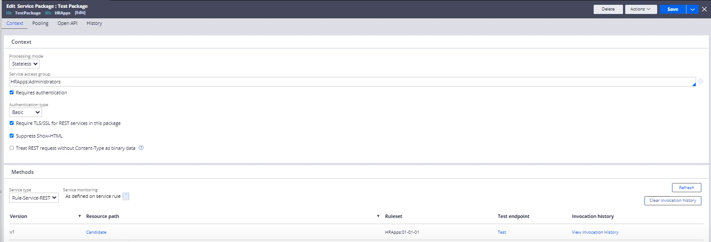

# Configuring a Service Package in Pega

A **Service Package** in Pega is a collection of service rules used to expose Pega applications for external systems via various protocols like REST, SOAP, or file-based services. Here’s a guide on setting up a Service Package in Pega.

---

### 1. Context Tab  
- **Processing Mode**: Choose between **Stateless** (no data sharing between service calls) or **Stateful** (data sharing needed across calls).
- **Service Access Group**: Defines the access group that will execute the service; must have the appropriate permissions.
- **Authentication**:
  - **Require Authentication**: Ensures only authorized users can access the service.
  - **Authentication Type**: Options include Basic (username/password), OAuth, and Custom.
  - **Require TLS/SSL**: Ensures data is transmitted securely (recommended for REST services).
  - **Suppress Show-HTML**: Prevents HTML display in error messages.
  - **Treat REST Request without Content-Type as Binary Data**: Useful for handling binary files without specified content types.

---

### 2. Pooling Tab  
- Configure request pooling settings:
  - **Max Idle Requests**: Maximum idle requests allowed in the pool.
  - **Max Active Requests**: Maximum number of active requests allowed.
  - **Max Wait (sec)**: Maximum time (in seconds) a request waits before timing out.

---

### 3. Methods Tab  
- **Service Type**: Select the service type, such as Rule-Service-REST for RESTful services.
- **Service Monitoring**: Choose whether the monitoring is enabled based on service rules.
- **Version, Resource Path, and Ruleset**: Specify these fields to define the endpoint details.

---

### 4. Open API and History Tabs  
- The **Open API** tab allows for further customization if exposing APIs via OpenAPI standards.
- The **History** tab shows invocation history for audit and troubleshooting purposes.

---

A well-configured Service Package can help streamline external integrations with Pega applications by ensuring secure, scalable, and efficient service access.

---

